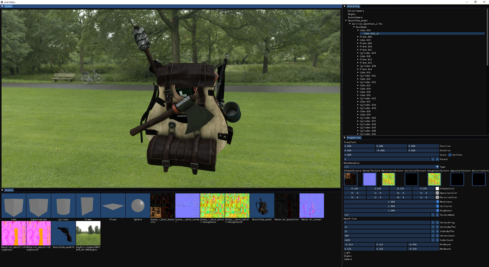

# Kuki

I'm teaching myself graphics programming, game engine architecture and C++ through this hobby project.



## How to Build

### Requirements

- [Git](https://git-scm.com/downloads), [CMake](https://cmake.org)
- **Windows:** [Visual Studio](https://visualstudio.microsoft.com/vs/community) (install **Desktop development with C++** workload)
- **Linux:** [Ninja](https://ninja-build.org), [GCC](https://gcc.gnu.org)

### Instructions

- Clone this repository and its submodules

```bash
git clone --recursive https://github.com/msagca/kuki
```

> To update the submodules, run `git submodule update --init --recursive`

- Change the path to project root

```bash
cd kuki
```

- Run CMake configure and build commands

```bash
cmake -B build
```

```bash
cmake --build build
```
